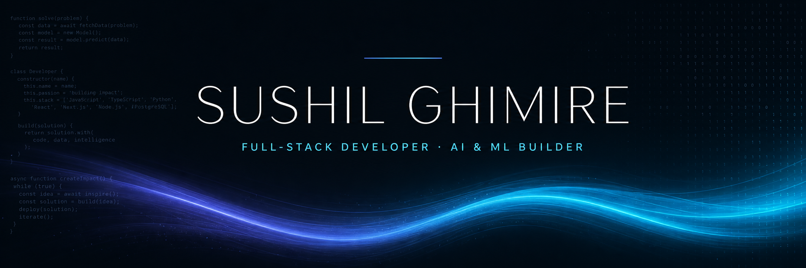

<div align="center">

[](https://github.com/17sushil)

</div>

## ⚡ About Me

```js
const sushil = {
  role: "Frontend Developer → Full-Stack & AI Builder",
  education: "Computer Engineering @ Advance College of Engineering & Management",
  work: "Nobel Trade Concern Pvt. Ltd.",
  location: "Kalanki, Kathmandu, Nepal 🇳🇵",
  code: ["JavaScript", "Python", "HTML", "CSS"],
  focus: ["React", "Node.js", "Express", "Machine Learning"],
  philosophy: "Detail-obsessed. Pixel-perfect. User-first.",
  currentlyBuilding: "MedBridge — AI-powered hospital medicine exchange 🏥",
  funFact: "Can spend 6 hours hunting a 1px misalignment — and enjoy it."
};
```

- 🎯 I design and build **beautiful, functional, user-friendly web experiences**
- 🧠 I love the full journey — from **UI pixels** to **Express APIs** to **training XGBoost models**
- 🏥 Currently shipping **MedBridge**, a hospital medicine-exchange platform for Nepal
- 🚀 Deploying real projects — [Drop Word Challenge is live](https://drop-word-challenge.vercel.app)
- 🤝 **Open to collaborations & opportunities** — let's build something people love

---

## 🛠️ Tech Stack

<div align="center">

**Languages & Core**

<a href="https://developer.mozilla.org/en-US/docs/Web/JavaScript" target="_blank"></a>
<a href="https://www.python.org" target="_blank"></a>
<a href="https://developer.mozilla.org/en-US/docs/Web/Guide/HTML/HTML5" target="_blank"></a>
<a href="https://www.w3schools.com/css/" target="_blank"></a>

**Frontend & Backend**

<a href="https://reactjs.org/" target="_blank"></a>
<a href="https://vitejs.dev/" target="_blank"></a>
<a href="https://nodejs.org" target="_blank"></a>
<a href="https://expressjs.com" target="_blank"></a>

**Databases, AI/ML & Tools**

<a href="https://www.prisma.io/" target="_blank"></a>
<a href="https://www.postgresql.org" target="_blank"></a>
<a href="https://fastapi.tiangolo.com" target="_blank"></a>
<a href="https://jupyter.org" target="_blank"></a>
<a href="https://git-scm.com/" target="_blank"></a>
<a href="https://github.com/" target="_blank"></a>
<a href="https://www.figma.com/" target="_blank"></a>
<a href="https://vercel.com" target="_blank"></a>
<a href="https://code.visualstudio.com" target="_blank"></a>

</div>

---

## 🚀 Flagship Project

<div align="center">
<table>
<tr>
<td width="100%">

### 🏥 [MedBridge](https://github.com/17sushil/MedBridge)
**Hospital Medicine-Exchange Platform for Nepal**

Hospitals track their own medicine inventory (batches, quantities, expiry, pricing),
request surplus stock from partner hospitals on the network, and get **AI-assisted insights** —
live inventory Q&A, demand forecasting, expiry alerts, and smart exchange matching.

**Architecture I built:**
```
React SPA ──HTTP──▶ Express API ──Prisma──▶ PostgreSQL
     │                    │
     │                    └──▶ FastAPI ML service (XGBoost)
     └── AI assistant (LLM + RAG over live inventory)
```


</td>
</tr>
</table>
</div>

### 🧩 More Projects

| Project | What it does | Stack |
|---------|--------------|-------|
| [🗣️ **Voice Email System**](https://github.com/17sushil/voice-email-system) | Offline-first voice assistant — *send, read, search & reply to emails by speech*. STT runs 100% locally, no audio ever leaves your machine | `Python` `Vosk` `IMAP/SMTP` `pyttsx3` |
| [🏢 **Nobel Trade Concern**](https://github.com/17sushil/Nobel-Trade-Concern) | Company web platform with client app, API & server — deployed on Vercel | `JavaScript` `Vercel` |
| [✂️ **Barber Booking System**](https://github.com/17sushil/Barber-Booking-System) | Appointment booking system with a smooth booking flow | `JavaScript` |
| [📌 **Kanban Board**](https://github.com/17sushil/Kanban-) | Dynamic task board with full drag-&-drop interaction | `JavaScript` `HTML` `CSS` |
| [🎓 **Student Dashboard**](https://github.com/17sushil/STUDENT-DASHBOARD) | Clean student dashboard UI with sidebar navigation | `JavaScript` |
| [🐍 **Snake Game**](https://github.com/17sushil/Snake-Game) | The classic, hand-rolled in vanilla JS | `JavaScript` |
| [🎨 **UI Design & Clones**](https://github.com/17sushil/UI-design) + [Sundown clone](https://github.com/17sushil/Sundown-Website-Clone) + [Pinterest clone](https://github.com/17sushil/Pinterest) | Pixel-focused UI cloning practice — sharp eyes are earned here | `CSS` `HTML` |
| [⌨️ **Drop Word Challenge**](https://github.com/17sushil/Drop_Word_Challenge) — ▶️ [LIVE DEMO](https://drop-word-challenge.vercel.app) | Typing-speed booster game | `Python` |
| [🚕 **Taxi Fare Prediction**](https://github.com/17sushil/Taxi_Fare_Prediction) | ML regression on real trip data | `Python` `Jupyter` |
| [📊 **Machine Learning Projects**](https://github.com/17sushil/Machine-Learning-Projects) | ML notebooks, basic → pro level | `Jupyter` `Python` |

---

## 📊 GitHub Stats & Achievements

<div align="center">


<!-- 🐍 SNAKE ANIMATION — after running the workflow in .github/workflows/snake.yml, uncomment the block below to activate it
<picture>
  <source media="(prefers-color-scheme: dark)" srcset="https://raw.githubusercontent.com/17sushil/17sushil/output/github-contribution-grid-snake-dark.svg" />
  <source media="(prefers-color-scheme: light)" srcset="https://raw.githubusercontent.com/17sushil/17sushil/output/github-contribution-grid-snake.svg" />
  
</picture>
-->

</div>

---

## 🌱 Currently

- 🔨 Building **MedBridge** — connecting hospitals, powered by AI
- 📚 Deep-diving **system design** & **LLM applications (RAG)**
- ✨ Shipping polished frontends — motion, micro-interactions, accessibility

---

## 🤝 Let's Connect

<div align="center">

[](https://github.com/17sushil)
[](https://www.linkedin.com/in/sushil-ghimire)
[](https://github.com/17sushil/My-portfolio)
[](mailto:your.email@example.com)

</div>

---

<div align="center">


**⭐ From [Sushil Ghimire](https://github.com/17sushil) — built with curiosity, caffeine & clean code**

*“First, solve the problem. Then, write the code.”*

</div>
